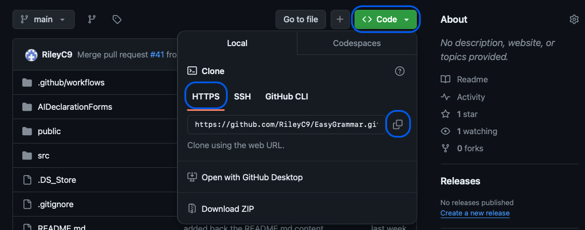

# EasyGrammar

## 📖 Overview:

Our project aims to develop an application that will assist users in improving their English language skills. This project is developed using **React**, **Free Dictionary API** and **OpenAI API**.

## 🎯 Project Objectives:

Our objective is to create a website having the ability to help people who want to **improve their English vocabularies**. People can always check the dictionary and learn new words. However, learning a language, or vocabularies, is all about practice.
  Therefore, we create this AI powered English vocabulary website, allowing our users to search a vocabulary. The website will display the definitions, sample sentances, and pronounciation from Free Dictionary API to our users. 
  Moreover, we will use the word being searched to create an image from OpenAI API. We believe this will help the user to remember the vocabulary through visualization. Beside, users can practice their English writing by describing the image. Their description will be sent to OpenAI API for grammar analysis. In this way, the users can receive customised feedbacks based on the grammar mistakes they made, and our objective will be achieved.

## 🚀 Project Features:

- **Provide definitions**: Users can search a vocabulary and get the definition.
- **Sample sentence retrieval**: Users can learn sample sentence.
- **Pronunciation**: Users can listen to the pronunciation of the word.
- **Image generation and display**: Users can see an image generated from the sample sentances.
- **Check for grammar and sentence correctness**: Users’ description will be sent to OpenAI API for grammar analysis.
- **Feedback and scoring mechanisms**: Users will receive customised feedbacks based on the grammar mistakes they made.

## 👥 Project Contributors:

- TingHin Cheung, Riley [RileyC9](https://github.com/RileyC9)
- Xavier Pardanaud [Xav92](https://github.com/Xav92)
- Yujie Peng [Yujie](https://github.com/Peng-Yujie)
- Ravinesh Sami [rsami00](https://github.com/rsami00)

## ⚛️ Tech stack:

- HTML, CSS
- JavaScript ES6 / React
- Free Dictionary API
- OpenAI API
- Tailwind
- Netlify

## 💬 AI Declaration forms

- [TingHin Cheung](./AIDeclarationForms/p1_AI_declaration_TingHin_Cheung_100396747.pdf)
- [Yujie Peng](./AIDeclarationForms/p1_AI_Declaration_Yujie_Peng_100407970.pdf)
- [Ravinesh Sami](./AIDeclarationForms/p1_AI_Declaration_Ravinesh_Sami_100399749.pdf)
- [Xavier Pardanaud](AIDeclarationForms/P1_AI_Declaration_Xavier_Pardanaud_100309633.pdf)

## 🚥 Getting Started with Create React App

This project was bootstrapped with [Create React App](https://github.com/facebook/create-react-app).

## 💻 How to start our React website locally

All modern browsers should be able to support react website, expect Internet Exploere 11 or before (polyfills needed).

### Install React.js
If you have not install Node.js on your machine, you can visit the [freeCodeCamp](https://www.freecodecamp.org/news/how-to-install-react-a-step-by-step-guide/) and follow Step 1.

### Clone the repository to your local machine

- Scroll up to the top part of the [repository](https://github.com/RileyC9/EasyGrammar). 
- Click `<>Code`.
- Select HTTPS.
- Click the copy button beside the URL.

#### For Mac user:
- Open terminal and change to your desire directory.
- Input `git clone ` plus the URL you have just copied and hit Return. Remember to have a space character between clone and the URL in the command.
- Your machine should be cloning the remote repository from github to your local machine.
- Input `cd EasyGrammar` and hit Return.

In the project directory, you can run:

### Install all the necessary dependencies
### `npm install`

Install all the necessary dependencies to run the application.

### Start the application
### `npm start`

Runs the app in the development mode.\
Open [http://localhost:3000](http://localhost:3000) to view it in your browser.

The page will reload when you make changes.\
You may also see any lint errors in the console.

### [NPM Documentation](https://docs.npmjs.com)

The above steps should have the application running. But if you encounter some other problems, you can visit the npm documentation by clicking the link above to troubleshoot.